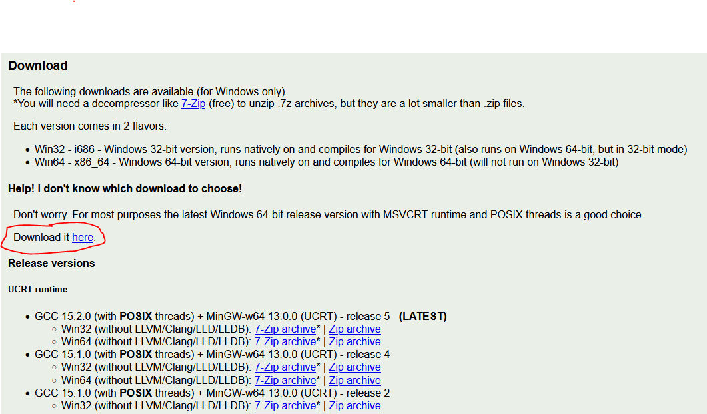
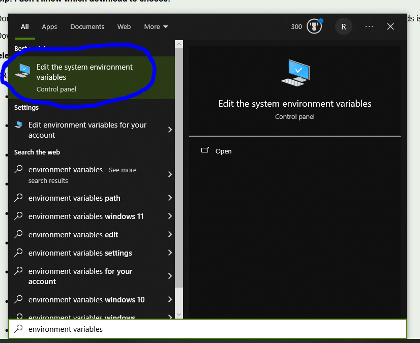
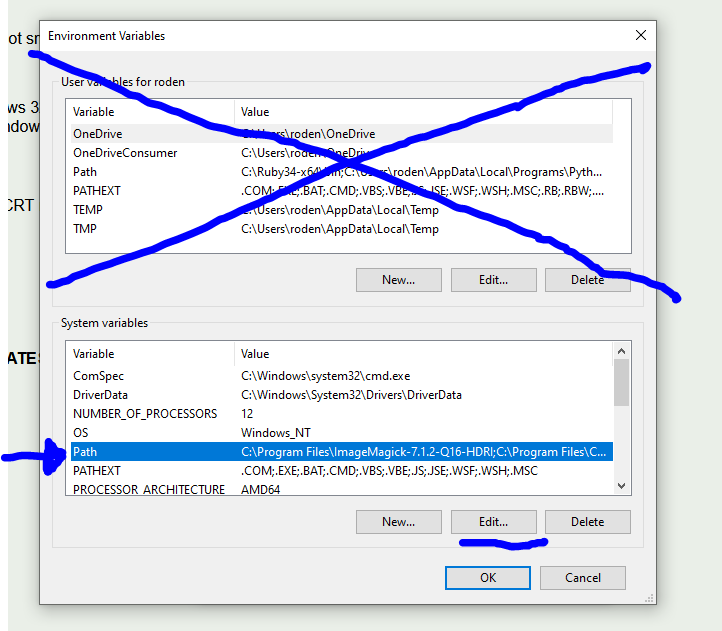
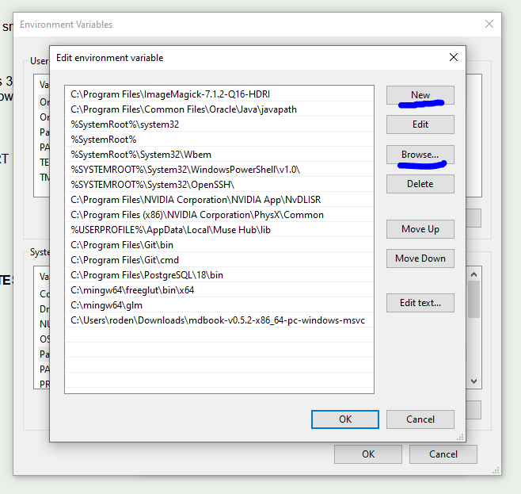

# Installation Process

## GCC Install
GCC or the GNU Compiler Collection is an open source collection of programming tools for lower-level languages like C, C++, FORTRAN, and Assembly. We will be using it to compile and run the programs for demos and homeworks using it.

### Windows
There are many methods to install gcc on Windows-based system, each attempting to stream-line some part of the process. We will be using WinLibs GCC pre-compiled version of the collection and manually adding it to the PATH so that you may use the programs in Windows CMD.

1. Go to [https://winlibs.com/](https://winlibs.com/):
   
2. Scroll down to the **Download** section:
   
3. Click on the red-circled "Download it here" to download the latest release for Windows 64-bit systems. If you need the 32-bit version for some reason, it is below. All modern computers are 64-bit so you should be fine with that.
4. That will download a zip file inside of your "Downloads" folder:
   
5. Right click on the file and select "Extract All", or use the top tools to select the same option as in the image:
   
6. That will open up a new dialog box asking where to extract the file contents to, click "Browse":
   
7. Using the File Explorer's side bar menu, scroll down to find "This PC->C:", click it, then press the "Select Folder" button, as indicated:
   
   
8. Click "Extract", and wait for the process to complete:
   
9. The compiler is now installed, however your windows Command Prompt cannot use the compiler and other tools until their locations have been added to the PATH. Click the search bar on the task bar and search for  "environment variables", click on the "Edit the system environment variables" option:
   
10. Click on the "Environment Variables..." button:
    
11. With the new menu that pops up, click on the "Path" option under "System variables", NOT the one that is for your account. With that selected click on the "Edit..." button:
    
12. In the new window, click "New" to add a new line to the PATH, then click "Browse...":
    
13. With the new file explorer open, go to "This PC->Local Disk (C:)->mingw64->bin", with "bin" as the selected folder:
    
14. Click "OK"
15. Click "OK"
16. Click "OK"
17. Click "OK"
18. GCC has now been installed on your Windows computer! To test this, search cmd in the search bar to open the command prompt
19. Type `gcc`, and press enter
20. This should result in the following error:
    
21. If something else happens, try the process again pay sure to follow the instructions and that you are always downloading and installing into local directories and not those on "OneDrive" or other such networked drives
22. If you continue to struggle, bring it up in class, or email me

### Mac
Apple products have their own suite of gcc tools installed by default, but to be sure that you have full access to them, we will be installing the GNU versions via Homebrew.

1. Go to [https://brew.sh/](https://brew.sh/)
2. Follow the instructions there to install brew. It should be
	1. Open macOS terminal
	2. Copy-Paste the command below
	   `/bin/bash -c "$(curl -fsSL https://raw.githubusercontent.com/Homebrew/install/HEAD/install.sh)"`
	3. Run and let it do its thing
3. With that installed, keep the terminal open and type: `brew install gcc`
4. And you are all done, you should now have access to the gcc command
5. You may test it similarly to the Windows test above, when run without any files given it should produce an error that says "no input files". If it says command not found, something is wrong and contact me.

### Linux
Usually during the installation process you install gcc and the other build tools as a consequence. If not just use your native package manager and install gcc.

## Text Editor or IDE Install
There is no required text editor for this course, however for nearly all of the in-class demos I will be using Sublime Text as my primary text editor. 

Integrated development environments or IDEs are a little too high-level for courses and remove some of the learning process for students. They also may end up becoming topics to learn in themselves. So, while there is no hard ban on students using tools like VScode or other powerful coding platforms, I strongly suggest the use of simple text editors like Sublime Text.

To install Sublime Text, go to [https://www.sublimetext.com/](https://www.sublimetext.com/) and it will have a specialized installation process for your system on the website. Just click the button that says "Download for (YOUR SYSTEM)", and follow the instuctions.
