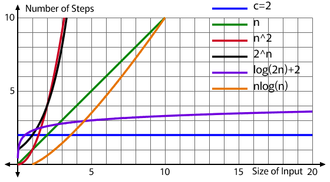

# Runtime Analysis Fundamentals

Why do some programs feel fast while others make us want to throw our computers out the window? Why does sorting 100 items take milliseconds but sorting 100,000 items takes minutes? The answer lies in understanding how algorithms scale.

In this lesson, we'll develop a mathematical framework for measuring runtime that works regardless of what computer you're using or what programming language you choose.

This lesson covers how to:

- Explain why we can't just time algorithms to compare them
- Construct a runtime function T(n) for simple algorithms
- Identify the dominant components that drive runtime growth
- Recognize common patterns of growth (linear, quadratic, logarithmic, etc.)
- Predict which of two algorithms will be faster for large inputs
## Algorithms

To review briefly:

- Computational problems are formal definitions of problems that outline the intended input and the desired output
- Algorithms are solutions to computational problems that use a finite number of sequential steps to go from input to desired output
- Programs are implementations of algorithms 
- The most basic way to assess an algorithm is to measure how many of the possible inputs can be solved using it, if it solves all problem instances, it is said to be correct. It is incorrect if it does not solve for one or more instances of the problem space

Now that the background is laid, we need to consider other ways of assessing algorithms, especially in terms that relate to programs and the domain we are solving in, digital computers. When speaking about modern computers, there are two basic attributes that dictate how good a computer is viewed in the modern day:

- **Execution Speed:** How fast operations are being executed
- **Memory Size:** How much space do we have to store information

In the same light, we assess the programs we use in these terms too. If a program is too slow, or uses too much RAM, we do not like it and identify it as a problem. Computers have gotten so good that we assume that all algorithms/programs are correct, it is just a matter of speed and resources. 

!!! note "Correctness Going Forward"
	 While correctness is probably the most important metric we could measure from an algorithm, we will always be attempting to make algorithms completely correct by default. This shifts the focus to those two attributes above. In fact, in most formal definitions algorithms are assumed to be correct. This lead to the division between **deterministic algorithms**; algorithms that have completely predicable behavior, always producing the same, correct output for any given input. And **probabilistic algorithms**; algorithms that use randomness in their execution, which means their correctness, runtime, or memory usage may vary between runs even with identical inputs. We mainly focus on pure, correct, deterministic algorithms, but by the end of the semester we will see some probabilistic algorithms.

### Input Size

With this in mind, how do we measure the time an algorithm takes or how much memory it takes up? To begin to tackle this, we should identify that the size of the input matters a lot for both of these metrics.

**Input size** depends on the problem being solved. For the problems we covered before like search, finding a max, or sorting, the input size is the amount of items in the input array/list. Take the finding max example from before:

- Algorithm: Max Element
	- Inputs: An array $A$ of $n$ numbers $[ a_0 , a_1, ..., a_{n-1} ]$, where $n > 0$
	- Output: $a_m$ the maximum number in the sequence
	- Procedure:
		1. $max \gets A[0]$
		2. $\text{for } i \gets 0 \text{ to } n -1 \text{ do:}$
			1. $\text{if } A[i] > max \text{ then:}$
				1. $max \gets A[i]$
			2. $\text{end if}$
		3. $\text{end for}$
		4. $\text{return } max$

Here the input size is denoted with $n$, as $n$ increases, the algorithm will need to run more times, since its for loop is bounded by $n-1$.  However, input size does not need to be connected to the number of elements in an array, it could be the size of the numbers coming in, take the following algorithm for two binary numbers being added: 

- Algorithm: Binary Addition 
	 -  Inputs: Two binary numbers $A$ and $B$ of $n$ bits each, $A = [a_{n-1}, a_{n-2}, ..., a_0]$ and $B = [b_{n-1}, b_{n-2}, ..., b_0]$ 
	 -  Output: Binary number $C$ representing $A + B$ 
	 - Procedure: 
		 1. $carry \gets 0$ 
		 2. $C \gets \text{empty array of size } n+1$ 
		 3. $\text{for } i \gets 0 \text{ to } n-1 \text{ do:}$ 
			 1. $sum \gets a_i + b_i + carry$ 
			 2. $C[i] \gets sum \mod 2$ 
			 3. $carry \gets \lfloor sum / 2 \rfloor$ 
		 4. $\text{end for}$ 
		 5. $C[n] \gets carry$ 
		 6. $\text{return } C$

Here we add two numbers always, but their sizes deem how long the algorithm runs. So its not always about lists or collections alone, but the size of the data being represented.

### Runtime of Algorithms

We keep talking about the amount of time it takes an algorithm to run or if an algorithm is slow or fast, how can we measure that? Is it just the time it takes for the program implementing an algorithm to run on some computer? Let's test this, say we have two programs that implement the same algorithm and are given the same input. Further imagine that we have Computer A and Computer B. If we run both programs on Computer A, they will take the same amount of time to run, lets say 5 microseconds. We then move one copy of the program to Computer B and then race the two computers running the same program on the same input as before. We get the following results: 
  
- **Results**
	- Program on Computer A = 5 microseconds
	- Program on Computer B = 10 microseconds

Without knowing about the specs of A or B, we can see that B probably is a worse computer. However, which number would we use as the runtime for our algorithm given the input? What would happen if we programmed them in a different language that sped up or slowed down the program?

These questions are the reason why the runtime of an algorithm is not usually measured using the physical time it takes for an algorithm to generate an output for a given input. It is completely dependent on the implementation of the algorithm and where it is being ran, which makes it not the best metric for these abstract, almost universal algorithms. 

To attend to this nature, the **runtime (or running time)** of an algorithm on a particular input is measured using the number of primitive operations or "steps" executed. These primitive operations are meant to be machine-independent and assumed they all take a constant amount of time. For us, this means we assume that each line of pseudocode of an algorithm takes a constant amount of time for a hypothetical computer to accomplish, lets call the amount of time $c$. Some lines of the pseudocode may take longer than others, so lets say that $c_i$ is the constant amount of time it takes for line number $i$ of pseudocode to run. 

Using this notation we can develop an equation to measure the amount of time it takes for an algorithm to run. The following is an exercise in breaking down the Max-Element Algorithm from before. Note that, we will not be doing this entire process for every algorithm we want to compare (it gets messy), but we will use it to derive a more general and simple process for estimating the run time of an algorithm.

Here is the algorithm from before with the amount of time each line it takes and the number of times that line will be run labeled with it:

| No. | Step                                                 | $c_i$ | Number of Times |
| --- | ---------------------------------------------------- | ----- | --------------- |
| 1   | $max \gets A[0]$                                     | $c_1$ | 1               |
| 2   | $\text{for } i \gets 0 \text{ to } n -1 \text{ do:}$ | $c_2$ | $n+1$           |
| 3   | &emsp;$\text{if } A[i] > max \text{ then:}$          | $c_3$ | $n$             |
| 4   | &emsp;&emsp;$max \gets A[i]$                         | $c_4$ | $[0,n]$         |
| 5   | &emsp;$\text{end if}$                                | 0     | $n$             |
| 6   | $\text{end for}$                                     | 0     | $n+1$           |
| 7   | $\text{return } max$                                 | $c_7$ | 1               |

 Some things worth to mention before moving on:
 
 - Notice that steps that are not within a loop are ran only once
 - The for loop is ran $n+1$ times but its contents run $n$ times because the $for$ loop is evaluating until the condition is found to be false, meaning it will run $n$ times and then check its exit condition, adding another operation.
 - The if statement is checked each time the loop is ran, but its contents could run anywhere between $0$ and $n$ times. This is because depending on the input, it might not be ran (if the max is the first element) or it will be ran each iteration (the list is sorted and the final element is max). The range lower bound gives us the **best case** and the upper bound gives us the **worst case**.
 - The $end$ statements do not actually cost any time, these are just notations for pseudocode and can be omitted most times. 

To get the amount of time each operation takes for an input of size $n$ id quite easy, just multiply the constant time it takes to run that line and the number of times it will be ran based on $n$:

- Step 1: $(c_1)(1) = c_1$
	- This makes sense since this step is always ran once, never more or less, so it is always going to take this line $c_1$ amount of time no matter the input.
- Step 2: $(c_2)(n+1) = c_2n+c_2$
	- So for a size 4 input array: $c_2(4) + c_2 = 5c_2$ because the loop will go through each element and then at the end check one more time for the exit condition.

If we wanted to continue this and find the amount of time the entire algorithm takes for an input of size $n$, denoted as $T(n)$, we would just take the sum of each step's time cost and number of times ran. Note, since step 4 has a variable number of times ran, we will calculate its worst-case scenario runtime:

- $T(n)=c_1(1) + c_2(n+1) + c_3(n) + c_4(n) + c_7(1)$

After some simplification:

- $T(n)=c_1 + c_2(n+1) + c_3n + c_4n + c_7$
- $T(n)=c_1 + c_2n + c_2 + c_3n + c_4n + c_7$
- $T(n)= (c_2 + c_3 + c_4)n + (c_1 + c_2 + c_7)$

Here we can see that if we make $a = c_2 + c_3 + c_4$ and $b=c_1 + c_2 + c_7$, then we can simplify again to see: $T(n)=an+b$. Since $a$ and $b$ are sums of constants, they are constants themselves, making the running time able to be expressed using a **linear function** of $n$. 

Linear functions are the basic $y=mx+b$ form of functions that describe a constant growth of $m$ offset by $b$ for a changing value of $x$. We are saying here that as the size of the input, $n$, grows, the runtime of the algorithm grows at a constant rate. Say that the sum of $a$ is 4 milliseconds and $b$ is 5 milliseconds and we evaluate the worst-case scenario for arrays of sizes 1 - 5:

{ width="350"; align=right }

| $n$ | $T(n)=4n+5$ |
| --- | ----------- |
| 1   | 9           |
| 2   | 13          |
| 3   | 17          |
| 4   | 21          |
| 5   | 25          |

  
We can see this constant growth by the addition of 4 at each increment of $n$, as well as by the straight line with a constant slope. Note that this is the worst-case scenario where we assumed that it would take the maximum number of steps possible. If we did the best-case, it would still be a linear line although the slope component $a$ would have $c_4$ removed, and make it a slightly slower linear growth (meaning it will be faster for all values of $n$). Most of the time we will measure the worst-case of an algorithm, so as to always have a maximum of how long the algorithm could take to run.

The following is another example of breaking down an algorithm that checks if an array contains any duplicate values. Note this is another messy bit of math, focus less on the specifics of the math and more the intuition that it leads to; **different algorithms have different runtimes as $n$ grows**:

- **Algorithm: Contains Duplicates**
	- **Input:** An array $A$ of $n$ numbers $[a_0, a_1, ..., a_{n-1}]$
	- **Output:** `true` if there are duplicates, `false` otherwise
	- **Procedure:**

| No. | Step                                                        | $c_i$ | Number of Times           |
| --- | ----------------------------------------------------------- | ----- | ------------------------- |
| 1   | $\text{for } i \gets 0 \text{ to } n-1 \text{ do:}$         | $c_1$ | $n+1$                     |
| 2   | &emsp;$\text{for } j \gets i+1 \text{ to } n-1 \text{ do:}$ | $c_2$ | $\sum_{i=0}^{n-1}(n-i)$   |
| 3   | &emsp;&emsp;$\text{if } A[i] = A[j] \text{ then:}$          | $c_3$ | $\sum_{i=0}^{n-1}(n-i-1)$ |
| 4   | &emsp;&emsp;&emsp;$\text{return true}$                      | $c_4$ | $[0,1]$                   |
| 5   | &emsp;&emsp;$\text{end if}$                                 | 0     | -                         |
| 6   | &emsp;$\text{end for}$                                      | 0     | -                         |
| 7   | $\text{end for}$                                            | 0     | -                         |
| 8   | $\text{return false}$                                       | $c_8$ | 1                         |

- The outer loop runs $n$ times (checking the exit condition $n+1$ times)
- For each iteration $i$ of the outer loop, the inner loop runs $(n-i-1)$ times
- In the **worst case** (no duplicates found), we check every pair of elements

**Calculating the worst-case runtime:**

For the inner loop iterations across all outer loop iterations (simplifying using arithmetic series math):

$$\sum_{i=0}^{n-1}(n-i-1) = (n-1) + (n-2) + (n-3) + ... + 1 + 0 = \frac{n(n-1)}{2}$$

So our total runtime is after plugging in the previous:

$$T(n) = c_1(n+1) + c_2\left(\frac{n(n-1)}{2}\right) + c_3\left(\frac{n(n-1)}{2}\right) + c_8$$

Simplifying:

$$T(n) = c_1n + c_1 + \frac{c_2n^2 - c_2n}{2} + \frac{c_3n^2 - c_3n}{2} + c_8$$

$$T(n) = \frac{(c_2+c_3)}{2}n^2 + \left(c_1 - \frac{c_2+c_3}{2}\right)n + (c_1 + c_8)$$

If we let $a = \frac{c_2+c_3}{2}$, $b = c_1 - \frac{c_2+c_3}{2}$, and $c = c_1 + c_8$, we get:

$$T(n) = an^2 + bn + c$$

This is a **quadratic function**, one that forms a parabola with quadratic growth/decay on the arms. Let's see how this compares to our linear Max-Element algorithm.

Assuming $a = 2$ ms, $b = 1$ ms, and $c = 3$ ms:

| $n$ | Linear: $4n+5$ | Linear Change | Quadratic: $2n^2+n+3$ | Quadratic change |
| --- | -------------- | ------------- | --------------------- | ---------------- |
| 1   | 9              | -             | 6                     | -                |
| 2   | 13             | +4            | 13                    | +7               |
| 3   | 17             | +4            | 24                    | +11              |
| 4   | 21             | +4            | 39                    | +15              |
| 5   | 25             | +4            | 58                    | +19              |
| 6   | 29             | +4            | 81                    | +23              |
| 7   | 33             | +4            | 108                   | +27              |

{ width="350"; align=left }

Notice that this algorithm has an increasing rate of change that makes it take significantly more time as the size of the input grows. This growth is **quadratic** from the $n^2$ part of the time equation, this is called the **dominant component** and is the main contributor to the increasing rate of change and high total runtime the algorithm takes on a given input. If we wanted to understand generally about how an algorithm behaves on increasing input sizes, we could focus on this part and ignore the rest.

 
 

## Growth of Functions

In the previous section, we saw how we can examine an algorithm and estimate its runtime generally and machine-independently. After getting the time function, $T(n)$, for two algorithms, we saw that different algorithms take much longer than others as the input grows. In order to get there we had to do some simplifications. 

One was that we abstracted the cost of each line of pseudocode into a single value $c_i$. We then further simplified things down by taking groups of constants operating on one another (the creation of $a$ and $b$ in the Max Example). This shows that the constants individually can usually be ignored and abstracted into further mathematical constants that can be calculated for each implementation of the algorithm. Components like $n$ or $n^2$ are the important parts, everything else is machine dependent.

Continuing that idea, the **dominate components** that dictate how the function grows as $n$ increases should be the main focus of the analysis of an algorithm. For example, the linear growth of the Max Algorithm, represented using $T(n) = an+b$, $a$ and $b$ can be completely ignored until later. It is the $n$ part that informs the nature of how the function grows. Take the following graph as an example.

Here, we have the quadratic growth $n^2$ graphed along with various linear functions with different slopes:

{width="500"; .center}

Because quadratic growth has a ever-increasing rate of change, it will always overtake linear growth for some value of $n$, regardless of what constants are taken in account for the calculation. There are a few main types of growth we will be worrying about in this course:

- **Constant Value**: $c$
	- There is no growth to the function, it will always output constant $c$
- **Linear Growth** : $n$
	- Rate of change is constant
- **Quadratic Growth** : $n^c$
	- Rate of change increases by a constant rate $c$
- **Exponential Growth** : $c^n$
	- Rate of change increases by an increasing rate
- **Logarithmic Growth** : $log(n)$
	- Growth is determined by the log function
- **Log-Linear Growth** : $nlog(n)$
	- The result of doing $log(n)$, $n$ times. Growth is a mix of linear and logarithmic growth. For small values of $n$, log-linear is faster that linear, but as $n$ gets larger it overtakes linear.

Here is a graph with all of them:

{width="650"; .center}

As you can see the different functions all increase at different rates as $n$, the input size, increases. These represent the growth that any function can take, however, here each represents a function that describes how runtime increases as the size of the input for an algorithm increases. From here we can see that it is not the individual runtimes of instances that matter when assessing an algorithm, **it is the pattern of the growth of runtime as the input size increases.** 

